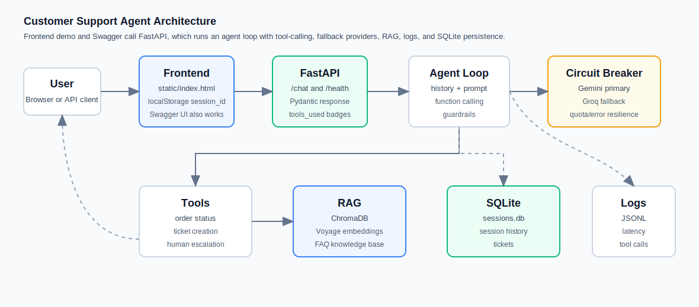

# Support Agent

Customer support agent berbasis FastAPI yang menggabungkan frontend chat sederhana, Gemini function calling, Groq fallback, ChromaDB RAG, guardrails, structured logging, SQLite persistence, dan automated tests.

- Live demo: https://cjoyy-support-agent.hf.space/
- Swagger UI: https://cjoyy-support-agent.hf.space/docs
- Case study: [CASE_STUDY.md](CASE_STUDY.md)

## Architecture

Text flow:

```text
User
  -> Frontend chat UI / Swagger UI
  -> FastAPI (/chat)
  -> Agent Loop (conversation history, guardrails, tool schema)
  -> Circuit Breaker
  -> Gemini primary / Groq fallback
  -> Tools and RAG
       -> search_knowledge_base -> ChromaDB + Voyage embeddings
       -> check_order_status -> local fixture
       -> create_ticket -> SQLite
       -> escalate_to_human -> structured handoff
  -> Response with tools_used
  -> Frontend renders answer + tool badges
```

Visual diagram:



## Tech Stack

| Component | Choice | Reason |
| --- | --- | --- |
| API | FastAPI | Lightweight API, Pydantic models, Swagger UI out of the box. |
| Frontend | Vanilla HTML/JS + Tailwind CDN | Minimal dependency footprint and enough UI polish for a public demo. |
| Primary LLM | Gemini `gemini-2.5-flash-lite` | Function calling support and free-tier friendly for a portfolio project. |
| Fallback LLM | Groq provider | Keeps the app responsive when the primary provider fails or quota is hit. |
| Agent orchestration | Custom no-framework loop | Full visibility into prompt, tool dispatch, fallback, history, and logs. |
| RAG store | ChromaDB | Simple local vector store for a small FAQ knowledge base. |
| Embeddings | VoyageAI | Good retrieval quality for support-policy chunks. |
| Persistence | SQLite `sessions.db` | Persists session history and tickets without running a separate database service. |
| Observability | JSONL logs | Easy to inspect latency, token cost, fallback events, and tool calls. |
| Deployment | Docker + Hugging Face Spaces | Reproducible runtime with a straightforward public demo path. |
| CI/CD | GitHub Actions | Runs the automated test suite on push and pull request. |

## Features

- RAG over local support policy documents using ChromaDB and Voyage embeddings.
- Tool-calling for knowledge search, order status, ticket creation, and human escalation.
- Guardrails for out-of-scope requests and uncertain knowledge-base answers.
- Multi-provider fallback with a circuit breaker around the primary LLM.
- Observability through structured JSONL tool, latency, fallback, and usage logs.
- Persistent storage for sessions and tickets via SQLite.
- CI workflow for automated tests.
- Frontend demo at `/` with chat bubbles, persistent browser session ID, and tool badges.

## Quick Start

Create `.env`:

```env
GEMINI_API_KEY=...
VOYAGE_API_KEY=...
GROQ_API_KEY=...
```

Build and run with persistent Docker storage:

```bash
docker build -t support-agent .
docker run -p 7860:7860 --env-file .env -v support-agent-data:/app/storage support-agent
```

Open:

```text
http://127.0.0.1:7860/
http://127.0.0.1:7860/docs
```

API smoke test:

```bash
curl -X POST http://127.0.0.1:7860/chat \
  -H "Content-Type: application/json" \
  -d '{"session_id":"demo-1","message":"Status order ORD123?"}'
```

Run tests:

```bash
python -m pytest tests -v
```

## Eval & Metrics Summary

The golden set in `eval/golden_set.json` contains 20 cases:

- FAQ: 5 cases.
- Order status: 4 cases.
- Ticket creation: 3 cases.
- Escalation: 3 cases.
- Out-of-scope guardrail: 3 cases.
- Multi-turn edge case: 2 cases.

Current recorded metrics:

| Metric | Value | Source |
| --- | --- | --- |
| Golden set size | 20 cases | `eval/golden_set.json:1-128` |
| Tool-call accuracy | `0/1` in the last recorded run, blocked by Gemini `429 quota exceeded` before tool call | `eval/results.json:6` |
| Per-tool accuracy | Computed per tool (`search_knowledge_base`, `check_order_status`, `create_ticket`, `escalate_to_human`, `null` for out-of-scope) | `eval/run_eval.py:50-73` |
| Avg latency | `6.59s` across two recorded traces | `logs/agent_log.jsonl:19-20` |
| P95 latency | Computed from eval case latencies | `eval/run_eval.py:27-31` |
| P95 total latency | Computed from latency_breakdown events | `eval/usage_summary.py:85-87` |
| Cost per conversation | `0.0000729 USD` for the recorded successful Gemini trace | `logs/usage_log.jsonl:1` |
| Tool-call success rate | Computed per tool from JSONL logs | `eval/usage_summary.py:97-108` |
| Distinct tools | 4 (`search_knowledge_base`, `check_order_status`, `create_ticket`, `escalate_to_human`) | `tools/handlers.py:262-267` |
| Automated tests | 13 passing tests | `tests/` — `test_agent.py` (3), `test_api.py` (2), `test_session.py` (3), `test_tools.py` (5) |
| Line coverage | Measured via `pytest-cov` in CI | `.github/workflows/test.yml:31` |
| CI pipeline | GitHub Actions on push/PR to `main` | `.github/workflows/test.yml:1-30` |

Run eval:

```bash
python eval/run_eval.py
```

Smoke eval:

```bash
python eval/run_eval.py --limit 3
```

## Persistence Notes

By default, local development writes SQLite data to `sessions.db` in the repo root. Docker sets `SUPPORT_AGENT_DB_PATH=/app/storage/sessions.db`, so use the same volume mount across restarts:

```bash
docker run -p 7860:7860 --env-file .env -v support-agent-data:/app/storage support-agent
```

On Hugging Face Spaces, default container disk can reset on restart or rebuild. For durable session and ticket storage, enable persistent storage in Space settings and point `SUPPORT_AGENT_DB_PATH` at the mounted path. Without persistent storage, SQLite data is best treated as demo-only state.

## Known Limitations

- Gemini free-tier quota can block eval or demos. The fallback provider helps at runtime, but the eval still needs an offline/mock mode to be stable in CI.
- SQLite is good for a single demo container, but not for high write concurrency or multi-replica production deployments.
- ChromaDB local storage is convenient, but production RAG should use a clearer managed storage or rebuild strategy.
- Eval currently checks tool selection and simple refusal behavior, not semantic answer quality.
- Observability is JSONL-based and useful for debugging, but it is not a full tracing stack.
- API error handling is still simple for missing secrets, provider quota, and dependency failures.
- Live demo availability depends on the Hugging Face Space rebuild finishing successfully after changes are pushed.

## Design Notes

See [CASE_STUDY.md](CASE_STUDY.md) for the design decisions, trade-offs, production-scale plan, metrics, and reflection.

## Final Checklist

- Automated tests pass locally: `13 passed` with `python -m pytest tests -v`.
- GitHub Actions should run the same `pytest tests/ -v` workflow after push.
- Live demo should be tested from a browser or another device after the Space rebuild completes.
- README and case study are complete and ready for proof-read before final submission.
